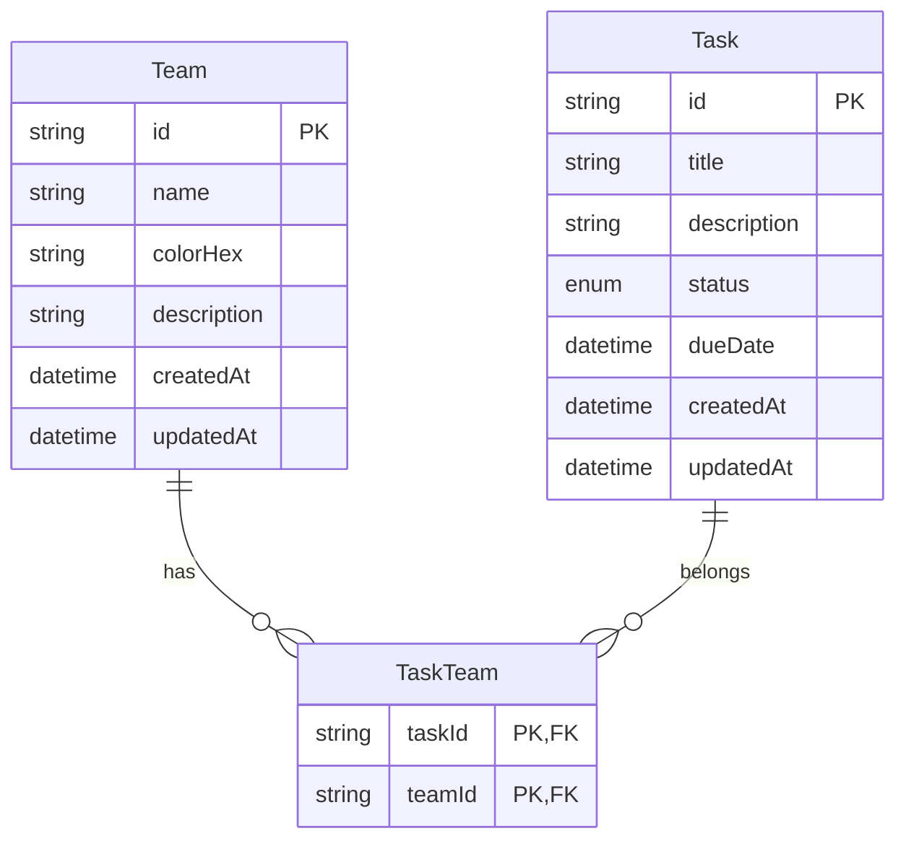

# Teams & Tasks

Monorepo com **backend Node.js/TypeScript** (API REST) e **app mobile React Native/TypeScript** para gerenciamento de Times e Tarefas.

## Estrutura do Projeto

```
├── backend/          # API REST (Fastify + Prisma + SQLite)
├── mobile/           # App React Native (Expo + NativeWind)
└── package.json      # Scripts do monorepo
```

## Pré-requisitos

| Ferramenta | Versão | Obrigatório |
|-----------|--------|-------------|
| [Node.js](https://nodejs.org/) | 20+ | Sim |
| npm | 10+ | Sim |
| [Expo Go](https://expo.dev/go) | mais recente | Sim (celular físico) |
| Android Studio | — | Opcional (emulador Android) |
| Xcode | — | Opcional (simulador iOS, só macOS) |

## Setup Rápido

Na raiz do repositório:

```bash
# 1. Instalar dependências, migrar banco e popular dados
npm run setup

# 2. Iniciar o backend (terminal 1)
npm run backend

# 3. Iniciar o app mobile (terminal 2)
npm run mobile
```

O backend sobe em `http://localhost:3000`. No emulador Android, o app usa `http://10.0.2.2:3000` automaticamente.

---

## Decisões Arquiteturais

### Banco de Dados: SQLite + Prisma

- **SQLite** para desenvolvimento local sem dependências externas (arquivo em `backend/prisma/dev.db`)
- Migrations versionadas com `prisma migrate deploy`
- Em produção, a troca para **PostgreSQL** exige apenas alterar o `datasource` no Prisma

### Modelo de Entidades

```
Team (1) ──< TaskTeam >── (N) Task
```

- **Team**: nome, cor (hex) e descrição opcional
- **Task**: título, descrição, status (`PENDING` | `IN_PROGRESS` | `COMPLETED`) e data de vencimento
- **TaskTeam**: junção N:N — uma tarefa pode pertencer a zero ou mais times

### Camadas do Backend

| Camada | Responsabilidade |
|--------|-----------------|
| `domain/` | Tipos de domínio, enums, erros customizados |
| `application/` | Services, schemas Zod, DTOs |
| `infrastructure/` | Prisma client, mappers entidade → DTO |
| `presentation/` | Rotas Fastify, error handler |

### Frontend Mobile

| Tecnologia | Uso |
|-----------|-----|
| **Expo + expo-router** | Roteamento file-based e hot reload |
| **React Query** | Cache e sincronização com a API |
| **react-hook-form + zod** | Formulários com validação |
| **NativeWind** | Estilização com utilitários Tailwind |

---

## Modelo de Dados



---

## Como Rodar

### Instalação (primeira vez)

```bash
npm run setup
```

Esse comando instala as dependências, cria o banco SQLite, aplica migrations e popula 3 times e 10 tarefas de exemplo.

### Backend

```bash
npm run backend
```

Aguarde `API rodando em http://0.0.0.0:3000` e valide:

```bash
curl http://localhost:3000/health
# {"status":"ok"}
```

### App mobile

Em outro terminal (com o backend rodando):

```bash
npm run mobile
```

O Metro Bundler sobe em `http://localhost:8081`.

### Visualizar no dispositivo

#### Celular físico

1. Instale o **Expo Go** ([Android](https://play.google.com/store/apps/details?id=host.exp.exponent) / [iOS](https://apps.apple.com/app/expo-go/id982107779))
2. Celular e computador na mesma rede Wi-Fi
3. Descubra o IP da máquina (`ipconfig` no Windows, `ifconfig` no macOS/Linux)
4. Crie `mobile/.env`:

```env
EXPO_PUBLIC_API_URL=http://SEU_IP:3000
```

5. Reinicie o Expo (`Ctrl+C` e `npm run mobile`)
6. Escaneie o QR code no terminal

#### Emulador Android

Inicie um AVD e pressione **`a`** no terminal do Expo. Não é necessário `.env` — o app usa `http://10.0.2.2:3000`.

#### Simulador iOS (macOS)

Pressione **`i`** no terminal do Expo. Usa `http://localhost:3000`.

#### Navegador

Pressione **`w`** para preview web rápido.

### Problemas comuns

| Problema | Solução |
|---------|---------|
| Lista vazia / erro de rede | Confirme o backend e configure `EXPO_PUBLIC_API_URL` com o IP correto |
| `Network request failed` no emulador | Use `http://10.0.2.2:3000` ou o emulador sem `.env` |
| Erro do Prisma ao iniciar | `cd backend && npx prisma generate` |
| Expo não inicia (Metro/lightningcss) | `cd mobile && rm -rf node_modules && npm install` |
| Firewall bloqueia o celular | Libere a porta **3000** no Windows |

### Scripts

| Script | Descrição |
|--------|-----------|
| `npm run setup` | Install + migrate + seed |
| `npm run backend` | Inicia API em modo dev |
| `npm run mobile` | Inicia Expo |
| `npm run seed` | Repopula banco com dados demo |
| `npm test` | Testes backend + mobile |

---

## API

### Formato de Resposta

**Lista:**
```json
{
  "data": [...],
  "meta": { "total": 10, "limit": 20, "offset": 0 }
}
```

**Item:**
```json
{ "data": { "id": "...", "name": "Frontend", ... } }
```

**Erro:**
```json
{
  "error": {
    "code": "VALIDATION_ERROR",
    "message": "Dados inválidos",
    "details": { ... }
  }
}
```

### Times

```bash
curl "http://localhost:3000/api/teams?limit=10&offset=0&search=front"

curl -X POST http://localhost:3000/api/teams \
  -H "Content-Type: application/json" \
  -d '{"name":"Design","colorHex":"#EC4899","description":"Time de UX/UI"}'

curl http://localhost:3000/api/teams/{id}

curl -X PUT http://localhost:3000/api/teams/{id} \
  -H "Content-Type: application/json" \
  -d '{"name":"Design System"}'

curl -X DELETE http://localhost:3000/api/teams/{id}
```

### Tarefas

```bash
curl "http://localhost:3000/api/tasks?teamId={teamId}&status=PENDING&search=login&limit=10&offset=0&sort=createdAt&order=desc"

curl -X POST http://localhost:3000/api/tasks \
  -H "Content-Type: application/json" \
  -d '{
    "title": "Implementar dark mode",
    "description": "Tema escuro no app",
    "status": "PENDING",
    "teamIds": ["{teamId1}", "{teamId2}"]
  }'

curl http://localhost:3000/api/tasks/{id}

curl -X PUT http://localhost:3000/api/tasks/{id} \
  -H "Content-Type: application/json" \
  -d '{"status": "COMPLETED"}'

curl -X DELETE http://localhost:3000/api/tasks/{id}
```

### Health Check

```bash
curl http://localhost:3000/health
# {"status":"ok"}
```

---

## Testes

```bash
npm test

# Apenas backend
npm test --workspace=backend

# Apenas mobile
npm test --workspace=mobile
```

**Backend:** schemas Zod (unit) e rotas da API com Fastify inject (integração).

**Mobile:** componente `StatusBadge` com React Native Testing Library.

---

## Licença

MIT
